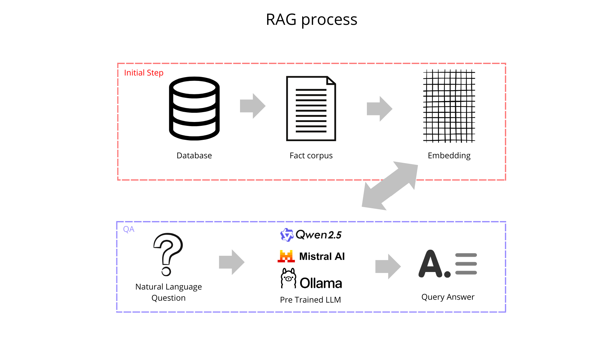

# Proof of Concept: Retrieval Augmented Generation with LLMs for a small set of facts derived from a Database.

This is a simple implementation of RAG using Sentence Transformers for embeddings and a local LLM for generation. The facts are stored in a simple text file, and the evaluation is done using a JSONL file with questions and expected answers. The facts are retrieved using cosine similarity. The LLM is used to generate answers based on the retrieved facts. The facts are derived from a database, but for simplicity, they are stored in a text file.

## Architecture

## TODO:

- [x] Add more data to the training
- [x] Use TPC-H data.
- [x] Test with other base models (e.g., Llama, Mistral).
